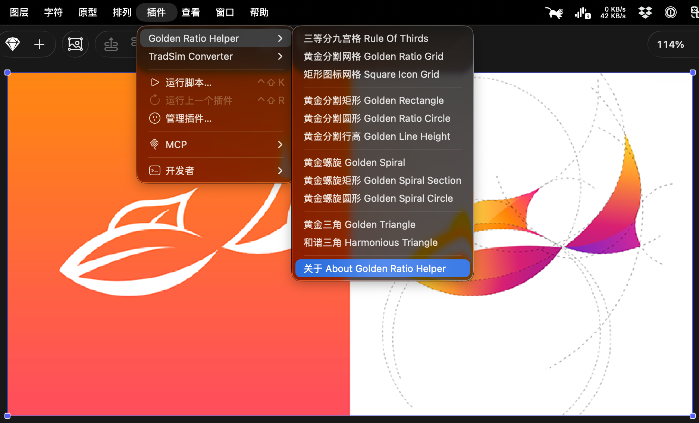
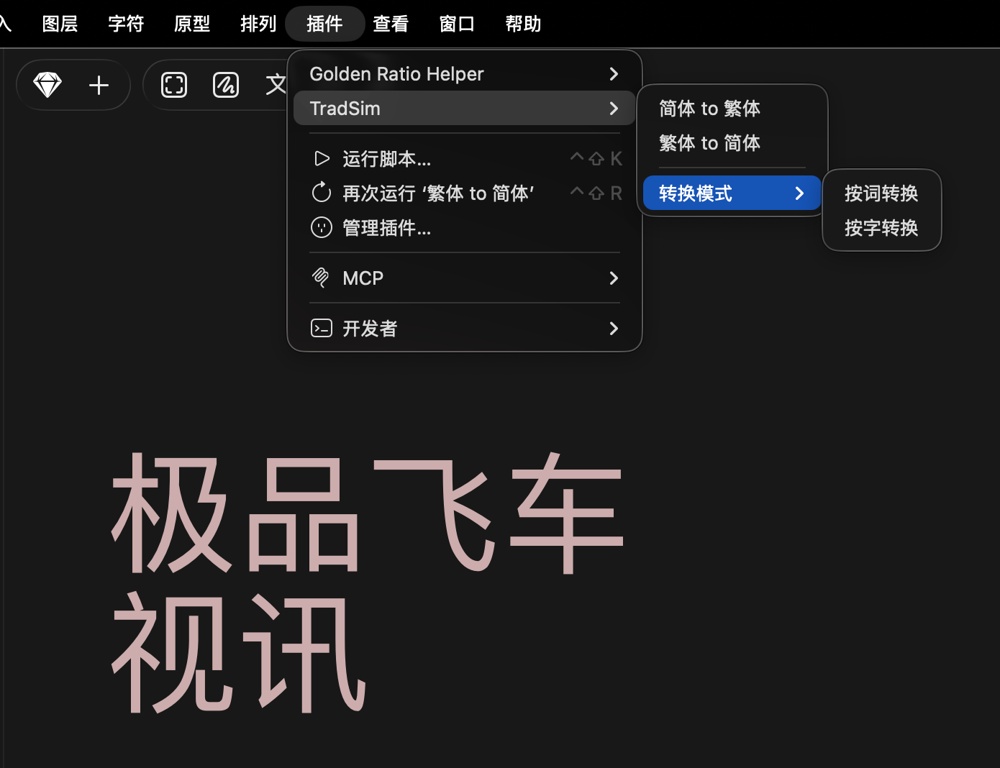

# Sketch.Ext
Extensions for Sketch

## Install:

1. Download **xxx.sketchplugin.zip** & unzip it.
2. Double click **xxx.sketchplugin** to install.

## Plugins:

### * Golden Ratio Helper: 

Draw golden ratio helper lines automatically. ([Download](Golden-Ratio-Helper.sketchplugin.zip?raw=true)) <a href="Golden-Ratio-Helper.sketchplugin.zip?raw=true" download>Download</a>

([Download](https://raw.githubusercontent.com/nanL/Sketch.Ext/main/Golden-Ratio-Helper.sketchplugin.zip))

([Download](https://raw.githubusercontent.com/nanL/Sketch.Ext/refs/heads/main/Golden-Ratio-Helper.sketchplugin.zip))

Thanks: [Lorenz Wöhr](https://github.com/lorenzwoehr/Golden-Ratio-Line-Height-Sketch-Plugin), [chord.luo](https://github.com/ichord/sketch-divine-proportions), [Codex](https://openai.com/codex/),

### * TradSim Converter: 

Convert text layers between Simplified and Traditional Chinese. ([Download](TradSim-Converter.sketchplugin.zip?raw=true))

Thanks: [TongWen Dict](https://github.com/tongwentang/tongwen-dict), [Codex](https://openai.com/codex/),

